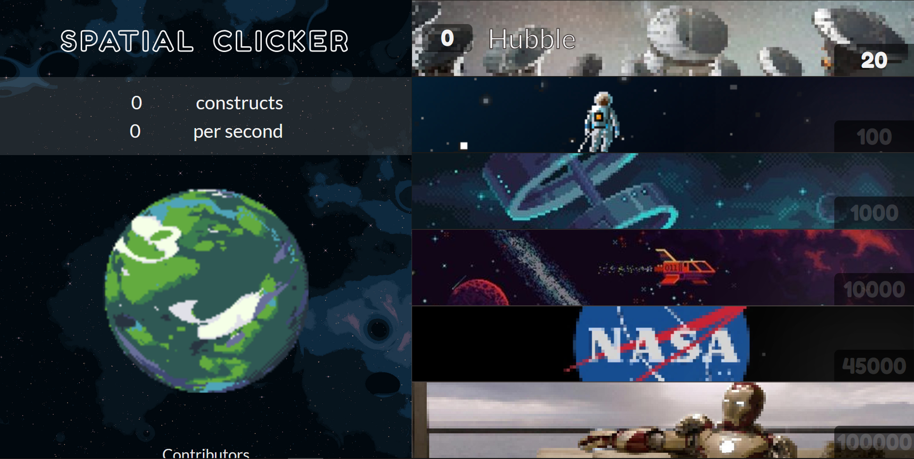

# Cookie-Clicker

   
  
## About  
  
**Authors :** [Anthony Lambert](https://github.com/Kaleidosport), [Sarah Dade](https://github.com/SarahDade), [Thibaut Fourneaux](https://github.com/FourneauxThibaut) & [Zaccaria Tabi](https://github.com/tbzaccaria).  
**Context :** Group assignment pertaining to the Junior WebDev's training provided by [BeCode](https://github.com/becodeorg), Javascript's 2nd part.  
**Origin :** [Cookie Clicker](https://github.com/becodeorg/CRL-Woods-5.33/blob/main/1.TRAIL/02.The-Hill/08.Javascript/Challenge/cookie.md).  
**Start date :** October 18th 2021.  
**End product :** [Spatial Clicker, starring Tony Stark](https://kaleidosport.github.io/Cookie-Clicker/).

## Learning objectives  

* To create a 3rd game using both JavaScript & Canvas in the aftermath of HangMan & PewPew  
* To divide our workload in the smartest way, meaning no one has to feel left out  
* To shape the whole project while abiding by a list of instructions  
* To deliver our very own version of this clicker game  

---  
  
## Group organization  

The least we can say is we benefitted from a great team chemistry throughout the whole project, so much so that we kept grinding to the very end. Though it proved difficult to divide the workload in such a way that everyone could feel satisfied, we let the group prevail over personal preferences.  

While Thibaut tends to work as a back-end dev, he took charge of the whole styling process. As for Sarah, she committed to the whole Canvas part. Zaccaria and Anthony both worked their way through the back-end part. We're bound to improve some aspects of the game asap, given that the current version lacks some of the features we thought of.  

## Project deployment  

The game benefits from its own Github Page, which we deemed the best way to render it accessible to whomever would wish to give it a try. Should you be unfamiliar with the core principles of the Cookie Clicker game, feel free to compare our version to [the original one](https://orteil.dashnet.org/cookieclicker/)! Anyway, here's a snap of our [Spatial Clicker](https://kaleidosport.github.io/Cookie-Clicker/). ↴  

    

  

## Under the outward guidance of...  

       